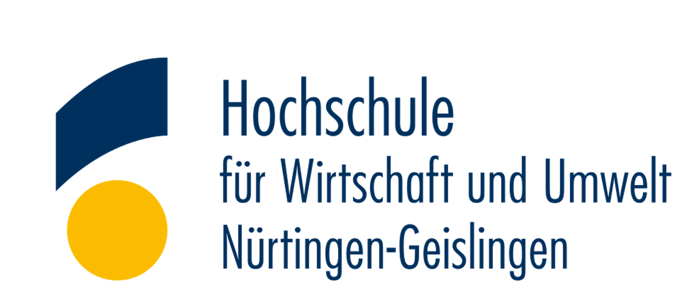

# KÄPSELE powered by HÖLDERLIN 🎓🤖


[](https://github.com/sponsors/ProfEngel)
[](https://www.youtube.com/user/MatMaxEngel)
[](https://opentuneweaver.com/)


Das **KÄPSELE** ist ein innovativer **MoE (Mixture of Experts) und Multi-Agenten-Chatbot**, der als KI-Tutor für die moderne Hochschullehre entwickelt wurde. Dieses **Tandemforschungsprojekt** im Rahmen des Digital Fellowship-Programms wird gefördert durch:

<div align="center">
  
  
</div>

**Projektleitung:** Prof. Dr. Mathias Engel & Tobias Leiblein  
**Institution:** Hochschule für Wirtschaft und Umwelt Nürtingen-Geislingen

## Über das Projekt

KÄPSELE ist ein wegweisendes Forschungsprojekt des [Fellowship-Programms 2024](https://www.stifterverband.org/bwdigifellows/2024_engel_leiblein), das vom **Ministerium für Wissenschaft, Forschung und Kunst Baden-Württemberg (MWK)** sowie dem **Stifterverband Deutschland** gefördert wird.

Das Projekt zielt darauf ab, einen bereits erfolgreich pilotierten KI-Tutor im gesamten Studienspektrum der Hochschule für Wirtschaft und Umwelt Nürtingen-Geislingen zu testen. Der Fokus liegt dabei auf:

- **Qualität des Lernoutputs** und Verbesserung der Lernergebnisse
- **Akzeptanz durch Lehrende** und Integration in bestehende Lehrkonzepte  
- **Technischer Mehrwert** für die moderne Hochschuldidaktik
- **Evaluierung durch Prä-Post-Kompetenzmatrix** zur Bestimmung optimaler Einsatzgebiete
- **Entwicklung hochschuldidaktischer Angebote** zur Technologieintegration
- **Skalierbarkeit** für weitere Hochschulen in Baden-Württemberg

## Systemarchitektur und Funktionsweise


Das KÄPSELE-System basiert auf einer durchdachten, containerisierten Architektur, die alle Komponenten nahtlos miteinander verbindet. Die gesamte Infrastruktur läuft vollständig in Docker-Containern (1), was eine einfache Bereitstellung, hohe Skalierbarkeit und unkomplizierte Wartung ermöglicht. Diese Containerisierung gewährleistet, dass das System sowohl lokal als auch in Cloud-Umgebungen zuverlässig funktioniert und sich problemlos auf verschiedene Hochschulinfrastrukturen übertragen lässt.

Das Herzstück des Systems bildet das intuitive Chatbot-Interface für Ad-hoc-Fragen (2), über das Studierende direkt mit dem KI-Tutor interagieren können. Dieses benutzerfreundliche Interface ermöglicht es den Lernenden, spontane Fragen zu stellen und sofortige, kontextuell relevante Antworten zu erhalten. Die Benutzeroberfläche ist so gestaltet, dass sie eine natürliche Konversation fördert und gleichzeitig den Zugang zu allen erweiterten Funktionen des Systems bietet.

Die vielfältigen Features des Chatbots (3) machen KÄPSELE zu einem umfassenden Lernbegleiter. Die integrierte Code-Ausführung ermöglicht interaktive Programmierung und direktes Code-Testing, während das RAG-System (Retrieval-Augmented Generation) Zugriff auf aktuelle Wissensdatenbanken bietet. Intelligente Suchfunktionen helfen beim gezielten Auffinden relevanter Informationen, und die Artefakte-Funktion unterstützt bei der Erstellung und Verwaltung von Lernobjekten. Das System kann sich durch Individualisierung an verschiedene Lernstile und -bedürfnisse anpassen. Über das Model Context Protocol (MCP/Tools) werden erweiterte Funktionalitäten bereitgestellt, während intelligente Automatismen (Agents) eine kontinuierliche Lernbegleitung und -unterstützung bieten.

Das technische Rückgrat bildet HÖLDERLIN, unser maßgeschneidertes Sprachmodell (4), das speziell für den Einsatz in der Hochschullehre entwickelt wurde. Es basiert stets auf dem aktuellsten SOTA (State-of-the-Art) Foundation Open-Source-Modell und verfügt über einen 8k-Kontext je User (ca. 16 DIN A4 Seiten), der umfassende und zusammenhängende Gespräche ermöglicht. Tools, Thinking und MoE (Mixture of Experts) sind aktiviert, um optimale Leistung und Ressourceneffizienz zu gewährleisten. Durch gezieltes Finetuning mit OpenTuneWeaver in Kombination mit RAG-Technologie wird das Modell kontinuierlich für spezifische Anwendungsfälle in der Lehre optimiert.

Die kontinuierliche Weiterentwicklung (5) stellt sicher, dass KÄPSELE immer auf dem neuesten Stand der Technik bleibt. Nach jedem Semester wird das System mittels [OpenTuneWeaver](https://github.com/ProfEngel/OpenTuneWeaver) auf das dann aktuell beste verfügbare LLM trainiert und bereitgestellt. Dabei werden bewusst MoE-Architekturen eingesetzt, um Ressourcen zu schonen, während Thinking- und Tools-Funktionalitäten für erweiterte Problemlösungskapazitäten sorgen. Dieser Zyklus gewährleistet, dass die Studierenden stets von den neuesten Entwicklungen im Bereich der künstlichen Intelligenz profitieren können.

---

## Was ist in dieser Repository enthalten

1. **Installationsanleitung** - Komplette Anleitung zur Nachbildung der KÄPSELE-Infrastruktur
2. **Systemprompts** für unser Basismodell HÖLDERLIN und den Data Science Tutor
3. **Diverse Beispiel-Eingabeprompts** für verschiedene Anwendungsfälle
4. **Eingabeprompts für Data Science und Python-Vorlesungen** - Direkt einsetzbar im Unterricht
5. **CodeInterpreter-Optimierung** - Der CodeInterpreter in OpenWebUI funktioniert optimal mit den hier bereitgestellten Prompts
6. **Inferenz-Geschwindigkeitstests** - Unter dem Ordner Benchmark Sprachmodelle finden sich Geschwindigkeitstests für verschiedene Grafikkarten und Sprachmodelle.

## 💖 KÄPSELE unterstützen

Helfen Sie uns dabei, KI-Entwicklung für Bildung und Forschung zu demokratisieren! Ihre Unterstützung ermöglicht es uns, weiterhin zugängliche KI-Tools für die Hochschullehre zu entwickeln und zu verbessern.

[](https://github.com/sponsors/ProfEngel)

**[Werden Sie Sponsor und unterstützen Sie unsere Mission!](https://github.com/sponsors/ProfEngel)** 🚀

## 📝 Feedback & Erfahrungsberichte erwünscht!

**Setzen Sie KÄPSELE an Ihrer Einrichtung ein?** Wir würden uns sehr über Ihre Rückmeldungen freuen!

Wenn Sie KÄPSELE nützlich finden und es in Ihrer Institution verwenden, laden wir Sie herzlich ein:

- **Teilen Sie Ihre Erfahrungen** mit uns - sowohl positive Erkenntnisse als auch Verbesserungsvorschläge
- **Lassen Sie uns wissen**, wie KÄPSELE Ihre Lehrpraxis verbessert hat
- **Erlauben Sie uns die Veröffentlichung** Ihrer Meinung und des Logos Ihrer Einrichtung als Referenz

**Kontaktieren Sie uns gerne:**
- 📧 E-Mail: [Prof Engel at HFWU](https://www.hfwu.de/mathias-engel/)
- 🐙 GitHub Issues: [Feedback einreichen](https://github.com/ProfEngel/Kaepsele/issues/new?assignees=&labels=feedback&template=feedback.md&title=%5BFeedback%5D)

### 🏛️ Einsatz an folgenden Einrichtungen

*Hier werden die Logos und Erfahrungsberichte der Einrichtungen veröffentlicht, die KÄPSELE erfolgreich einsetzen.*

---

## Medienberichterstattung & Interviews 📰

OpenTuneWeaver und unsere Forschung zu KI in der Bildung haben große Medienaufmerksamkeit erhalten. Hier sind aktuelle Interviews und Artikel mit Tobias Leiblein, Prof. Dr. Mathias Engel und dem Projekt:

### Aktuelle Presseberichterstattung

**⚡ [Lehr/Lernkonferenz 2025 - "Erprobung eines MoE und MultiAgenten – Chatbot als KI-Tutor für die Lehre"](https://www.lehrlernkonferenz-2025.de/programm)**  
*Lightning Talk: 09.10.2025*  
Lightning Talk zur Implementierung von Mixture of Experts (MoE) und Multi-Agenten-Chatbot-Systemen als KI-Tutoren in der Hochschullehre mit Präsentation experimenteller Ergebnisse und praktischer Anwendungen.

**🎤 [HAWAII der GHD - "Level up! KI-Tutor „Käpsele" und trainiertes Sprachmodell „Hölderlin" im Multiplayer-Modus"](https://www.hochschuldidaktik.net/hawaii-25)**  
*Präsentation: 26.09.2025*  
Konferenzvortrag über fortgeschrittene KI-Tutoring-Systeme im Multiplayer-Modus mit dem "Käpsele" KI-Tutor und dem maßgeschneiderten "Hölderlin" Sprachmodell für verbesserte Lernerfahrungen.

**📰 [VDI Nachrichten - "Professor Chatbot hilft den Studierenden"](https://www.vdi-nachrichten.com/karriere/studium/professor-chatbot/)**  
*Veröffentlicht: 17.01.2025*  
Fachartikel über den zunehmenden Einsatz künstlicher Intelligenz an Universitäten zur Verbesserung der Lehrqualität, mit Diskussion von Potenzial und Grenzen KI-gestützter Lernsysteme.

**📄 [Controlling & Management Review - "Generative KI im Controlling praktisch umsetzen"](https://www.springerprofessional.de/generative-ki-im-controlling-praktisch-umsetzen/51394852)**  
*Veröffentlicht: 01.08.2025*  
Wissenschaftlicher Artikel zur praktischen Umsetzung generativer KI im Controlling mit realen Anwendungsfällen und Methoden zur Integration von KI-Lösungen in Controlling-Prozesse.

**📰 [Nürtinger Zeitung - "Wie künstliche Intelligenz beim Studieren hilft"](https://www.ntz.de/nuertingen/artikel_hfwu-in-nuertingen-wie-kuenstliche-intelligenz-beim-studieren-hilft.html)**  
*Veröffentlicht: 03.12.2024*  
Bericht über die Unterstützung des Studiums durch KI, mit Fokus auf die Zusammenarbeit von Tobias Leiblein und Prof. Dr. Mathias Engel bei der Entwicklung von KI-Tutoring-Systemen und deren Auswirkungen auf zukünftige Lehrmethoden.

**📰 [Stuttgarter Zeitung - "Wie künstliche Intelligenz beim Lernen hilft"](https://www.stuttgarter-zeitung.de/inhalt.wissenschaftler-aus-nuertingen-wie-kuenstliche-intelligenz-beim-lernen-hilft.016cc0c8-debb-46b5-9fb4-8e99815dfcdb.html)**  
*Veröffentlicht: 23.09.2024*  
Artikel über die Unterstützung von Lernprozessen durch künstliche Intelligenz mit Forschungsergebnissen der HfWU Nürtingen-Geislingen und Diskussion von Chancen und Herausforderungen von Sprachmodellen wie ChatGPT für die akademische Lehre.

---

## 📜 Lizenz

Dieses Projekt ist unter der **MIT-Lizenz** veröffentlicht - siehe [LICENSE](LICENSE) Datei für Details.

KÄPSELE ist **Open Source** und steht allen Bildungseinrichtungen und Forschern zur freien Verfügung. Die MIT-Lizenz erlaubt:
- ✅ **Kommerzielle Nutzung**
- ✅ **Modifikation und Anpassung**  
- ✅ **Distribution und Weiterverteilung**
- ✅ **Private Nutzung**

Einzige Bedingung: Behalten Sie den Copyright-Hinweis und die Lizenzangabe bei.

## 📖 Zitierung

Wenn Sie KÄPSELE in Ihrer Forschung, Lehre oder Publikationen verwenden, zitieren Sie uns bitte wie folgt:

### BibTeX
```bibtex
@software{engel_leiblein_kaepsele_2024,
  author       = {Engel, Mathias and Leiblein, Tobias},
  title        = {{KÄPSELE: MoE and Multi-Agent Chatbot for Higher Education}},
  year         = {2024},
  publisher    = {GitHub},
  journal      = {GitHub repository},
  howpublished = {\url{https://github.com/ProfEngel/Kaepsele}},
  note         = {Funded by MWK Baden-Württemberg and Stifterverband Deutschland}
}
```

### APA-Format
```
Engel, M., & Leiblein, T. (2024). KÄPSELE: MoE and Multi-Agent Chatbot for Higher Education [Computer software]. GitHub. https://github.com/ProfEngel/Kaepsele
```

### Forschungsprojekt zitieren
```bibtex
@misc{engel_leiblein_fellowship_2024,
  author       = {Engel, Mathias and Leiblein, Tobias},
  title        = {{Digital Fellowship: KI-Tutor für die Hochschullehre - KÄPSELE powered by HÖLDERLIN}},
  year         = {2024},
  institution  = {Hochschule für Wirtschaft und Umwelt Nürtingen-Geislingen},
  note         = {Fellowship-Programm 2024, gefördert durch MWK Baden-Württemberg und Stifterverband Deutschland},
  url          = {https://www.stifterverband.org/bwdigifellows/2024_engel_leiblein}
}
```

---

**Erstellt von Tobias Leiblein, Prof. Dr. Mathias Engel 2024-2025** - Lassen Sie uns gemeinsam die Zukunft der Hochschuldidaktik gestalten! 💪

_Mit ❤️ in Nürtingen entwickelt_

***

## Über das Projekt

**Tobias Leiblein und Prof. Dr. Mathias Engel - ProfEngel** 

<div align="left">
  
</div>

**Hochschule für Wirtschaft und Umwelt Nürtingen-Geislingen**  
*Gefördert durch MWK Baden-Württemberg und Stifterverband Deutschland*

## 🤝 Mitwirkung erwünscht

Beiträge sind herzlich willkommen!  
Wenn Sie Ideen, Verbesserungen oder Fehlerberichte haben, öffnen Sie gerne ein **Issue** oder reichen Sie einen **Pull Request** ein.

## Star History
<a href="https://star-history.com/#ProfEngel/Kaepsele&Date">
  <picture>
    <source media="(prefers-color-scheme: dark)" srcset="https://api.star-history.com/svg?repos=ProfEngel/Kaepsele&type=Date&theme=dark" />
    <source media="(prefers-color-scheme: light)" srcset="https://api.star-history.com/svg?repos=ProfEngel/Kaepsele&type=Date" />
    
  </picture>
</a>